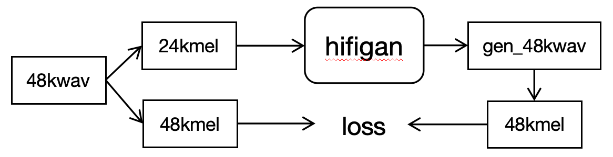
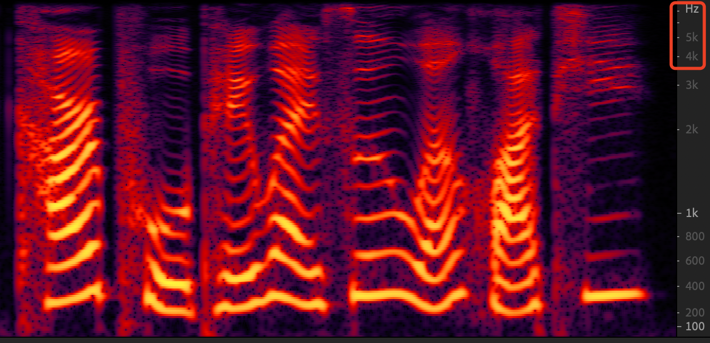
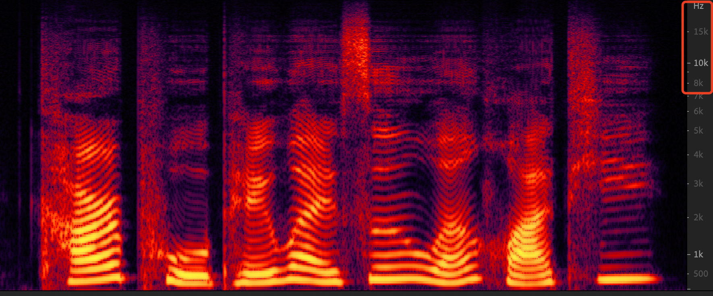

## Pre-requisites
1. Python == 3.8
2. Clone this repository.
3. Install python requirements. Please refer [requirements.txt](requirements.txt)
4. Download a 48k dataset, such as [genshin](https://github.com/AI-Hobbyist/Genshin_Datasets) or VCTK.


## Training
```
python train.py \
--config config_v1_16k_to_48k.json \
--input_wavs_dir VCTK-Corpus/wav48/,genshin --checkpoint_path exp/v1_16k_to_48k/
```
To train 24k_to_48k, replace `config_v1_16k_to_48k.json` with `config_v1_24k_to_48k.json`.<br>
Checkpoints and copy of the configuration file are saved in `checkpoint_path` directory by default.<br>
You can change the path by adding `--checkpoint_path` option.

## SR model sample theory
The hifigan means hiftnet here.


## SR results
Dir of ```gen_from_wav``` is the generated wavs, which sound good, and better than [hifigan-sr](git@github.com:liuhuang31/hifigan-sr.git).
- origin 16k mel-spectrum

- generated 48k mel-spectrum


## Pretrained Model
1. The pretrained models provided is in "exp/v1_16k_to_48k/g_bst", trained with StarRail_Datasets and VCTK.
2. For i don't have GPU resources, a kind person(@Lucy) train config_v1_16k_to_48k version and trained stop at 300k, maybe training to 800k is better.

## Inference from wav file
1. Make `test_files` directory and copy wav files into the directory.
2. Run the following command.
    ```
    # in inference.py, change the 'cp_path' param to your checkpoint dir.
    python inference.py
    ```
Generated wav files are saved in `generated_files` by default.<br>
You can change the path by adding `--output_dir` option.


## Reference
Our repository is heavily based on yl4579
's [HiFTNet](https://github.com/yl4579/HiFTNet).
